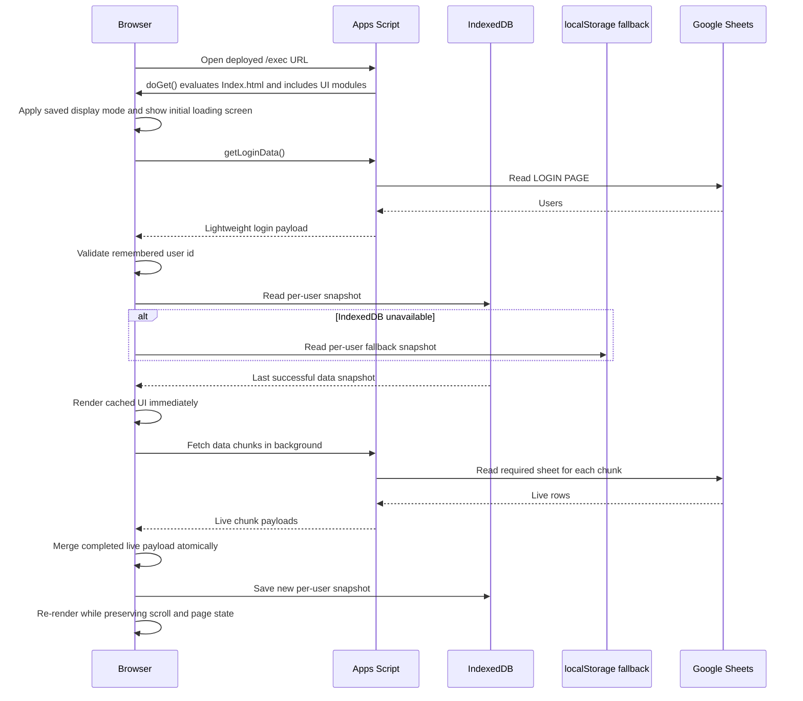

# UI and Cache-First Loading Guide

## Purpose

This document defines how the Finance 360° UI should open quickly, show previously loaded data without waiting for Google Sheets, and refresh live data in the background without making the screen blank, jump, or lag.

The required model is **stale-while-revalidate**:

1. Paint the application shell immediately.
2. Validate/resume the user session.
3. Show the last successful per-user snapshot from browser cache.
4. Fetch fresh Google Sheet data in the background.
5. Replace the cached snapshot only after the new payload is ready.
6. Save the successful live payload for the next opening.

## User experience requirements

### Returning user with cache

- The theme, sidebar, page title, and application shell must paint immediately.
- The last successful data snapshot must appear as soon as the remembered user is validated.
- The UI must remain usable while live data refreshes.
- A small status must say **Showing cached data · Refreshing live data…**.
- Cached figures must not disappear while live requests are running.
- When live data arrives, numbers and tables update in place.
- Current page, filters, table scroll, content scroll, sidebar scroll, column widths, and pagination must remain stable.

### First opening or empty cache

- Show the application shell and a clear loading/skeleton state.
- Do not show fake zero-value business figures while data is unknown.
- Show progress text such as **Loading live data for the first time…**.
- Save the first successful payload immediately so later openings are fast.

### Offline or failed live refresh

- Keep the cached snapshot visible.
- Mark it as cached and show its saved time.
- Show a non-blocking warning that live sync failed.
- Never replace valid cached data with a failed or indeterminate response.
- Treat an authoritative successful empty dataset as valid, so deleted sheet data does not remain stale forever.

## Current implementation

The repository already has a useful browser-snapshot foundation, but it does **not** yet satisfy every requirement in this guide. The sections labeled as requirements and acceptance criteria describe the target behavior; the current implementation and known gaps are documented separately below.

### Relevant files

| File | Responsibility |
| --- | --- |
| `Code.gs` | Serves the Apps Script web app, reads Google Sheets, maps rows, and returns data chunks. |
| `Index.html` | Builds the root page, prevents theme flash, and controls client script load order. |
| `Common.html` | Owns application state, login/session resume, IndexedDB cache, chunk loading, background refresh, rendering, and sync status. |
| `CSS.html` | Styles the shell, loading states, refresh indicators, responsive layout, and data grids. |
| `Filters.html` / `Grids.html` | Apply financial-year and table filters to the in-memory snapshot; navigation does not refetch data. |

## Current opening sequence



### 1. Server delivers the application HTML

`Code.gs` uses:

- `doGet()` to evaluate `Index.html`.
- `include(filename)` to inline CSS and client modules.

`Index.html` includes `Common.html` before modules that call `registerPage()`. `Common.html` starts asynchronous `loadAll()` while the remaining included scripts register pages synchronously. At this stage, the root contains an empty `#app`; `loadAll()` first renders the full-screen **Loading dashboard…** state. The sidebar/page shell is not rendered until login data has returned and a user is available.

### 2. Appearance paints before the app

The inline script in the `<head>` of `Index.html` reads these `localStorage` settings before the body paints:

- `app_display_mode`
- `app_color_scheme`
- legacy `tally_dark_mode`

This prevents a light/default-theme flash before the selected theme appears.

### 3. Remembered identity is matched in the browser

`loadAll()` in `Common.html` calls `getLoginData()` first. The server returns the LOGIN PAGE user records, including credentials, to client JavaScript. The browser then checks `tally_session_user_id` in `localStorage` and resumes the matching user ID.

This selects the per-user browser-cache key, but it is **not server-side authentication or authorization**. `getChunk()` and other data endpoints do not currently verify a session token. The current browser login controls the visible UI, not the server data boundary.

There is also a confirmed identity-switch gap: explicit and nightly logout clear `S.user` but leave finance arrays in memory. `doLogin()` does not clear those arrays before hydrating the next user. If user B has no cache or their refresh fails, user A’s data can remain visible and can be saved under user B’s cache key.

> Security requirement: replace the downloaded credential-list design with a server login endpoint, issue an expiring server-verifiable session, and validate that session on every data and mutation endpoint before treating the user as authenticated.

**Current limitation:** `getLoginData()` is a mandatory network call before cache hydration. If the Apps Script HTML is already open and later sheet calls fail, the cached UI can remain visible. A cold offline reload is different: the browser may not obtain the `/exec` HTML at all, and even if an HTTP-cached shell runs, startup cannot currently pass `getLoginData()`. True offline launch would require explicit shell asset caching plus a carefully designed locally verifiable signed session with expiry/revocation limitations. The existing design optimizes slow sheet-data loading, not a completely offline launch.

### 4. Browser cache hydrates the UI

`hydrateCachedData_()` reads a per-user snapshot using:

1. IndexedDB database: `finance360_data_cache`
2. Object store: `snapshots`
3. Key: normalized signed-in user ID
4. `localStorage` fallback prefix: `finance360_data_cache_v1:`

The snapshot structure is:

```js
{
  version: DATA_CACHE_VERSION,
  savedAt: 0,
  data: {
    expense: [],
    payables: [],
    receivables: [],
    receipt: [],
    payment: [],
    balanceParties: [],
    balanceVouchers: [],
    balanceLedgers: {},
    salesRows: [],
    expenseTrendRows: [],
    missingSheets: [],
    diagnostics: {},
    followUpLegacyMap: {},
    followUpHistoryRaw: []
  }
}
```

`applyDataPayload_()` puts this snapshot into the shared `S` state. `markSynced('cache', savedAt)` records the source and display time. The shell then shows the cached dashboard while `S.syncing` remains true.

### 5. Live data refreshes in the background

`loadHeavyData(true)` calls `loadChunks()` using these chunk keys:

```text
receivables
payables
expense
expenseTrend
receipt
payment
sales
balance
diagnostics
followUp
```

Each key calls `Code.gs#getChunk(tabKey)`. Chunks are intentionally separate because large Tally datasets can exceed the practical `google.script.run` response size when returned as one payload.

The current implementation loads chunks sequentially. This reduces response-size risk and avoids updating the UI after every partial response.

### 6. Live replacement is atomic from the user’s perspective

While chunks load, the cached snapshot remains in `S` and stays visible. `loadChunks()` builds a separate `livePayload` object.

After requests finish:

- `applyCompletedLiveSync_()` merges successful live chunks with the existing payload.
- `markSynced('live')` changes the source indicator.
- `writeCachedSnapshot_()` saves the refreshed snapshot.
- `render()` updates the screen.

The current render path attempts to preserve:

- `.content` scroll position
- the first `.dt-scroll` table position
- `#sidebarNav` scroll position

Only the sidebar preservation is complete. `CSS.html` makes `.content-zoom` the actual scrolling container on dashboard-style pages, but `render()` saves `.content`; pages with multiple grids also preserve only the first `.dt-scroll`. These are current gaps, not guarantees. In addition, `refreshData()` clears every grid’s text/date/number filters and resets grid pagination after a successful refresh, including silent ten-minute refreshes.

### 7. Navigation stays client-side

`navigateTo()` switches pages using the already-loaded in-memory state. It does not call Google Sheets on every sidebar click. This is essential for fast navigation.

### 8. Automatic refresh

`startAutoRefreshTimer_()` performs a silent full refresh every 10 minutes when:

- a user is logged in; and
- another sync is not already running.

Manual **Sync with Tally** uses the same refresh pipeline. Sales Report also has a page-scoped refresh mapping that loads only `sales` and `receivables`.

## UI states

The UI must always be in one of these explicit states:

| State | Data shown | Required status |
| --- | --- | --- |
| `booting` | None | Loading application… |
| `login` | None | Login form |
| `cache-loading` | None | Restoring saved data… |
| `cached-refreshing` | Cached snapshot | Showing cached data · Refreshing live data… |
| `live` | Latest successful payload | Live Tally data · Last refreshed at … |
| `first-live-loading` | None | Loading live data for the first time… |
| `refresh-failed-with-cache` | Cached snapshot | Cached data · Live sync failed |
| `fatal` | None | Setup/server error with retry action |

The current `S.ready`, `S.syncing`, `S.cacheLoaded`, `S.lastSyncSource`, `S.lastSync`, and `S.loadError` fields cover only part of this model. `cache-loading`, durable live-refresh failure, mixed/partial-live, stale-cache, and a working startup retry are not explicitly represented today. Implement these states rather than implying them from unrelated flags.

## No-lag rules for future development

1. **Never fetch on normal page navigation.** Pages must render from `S`.
2. **Never clear current data before a refresh.** Build the new payload separately.
3. **Never render every chunk as it arrives.** Apply a coherent payload once the refresh completes.
4. **Never write failed or indeterminate responses over a valid snapshot.** An explicitly successful empty dataset is authoritative and must be allowed to clear old rows.
5. **Always key cached finance data by validated user identity.**
6. **Always bump `DATA_CACHE_VERSION` when the cached payload shape changes incompatibly.**
7. **Keep appearance and lightweight preferences in `localStorage`; keep large datasets in IndexedDB.**
8. **Preserve UI position and state when background data replaces cache.**
9. **Show the data source and timestamp.** Users must know whether figures are cached or live.
10. **Do not calculate full report data during first paint if it can be calculated after cached state is available.**

## Gaps and recommended improvements

### Priority 0 — required safeguards

#### Move authentication and authorization to the server

This is the highest-priority prerequisite for any stronger cache or offline design.

Required changes:

- Do not return the complete LOGIN PAGE credential list to the browser.
- Validate credentials in a server endpoint.
- Issue an expiring session token after successful login.
- Validate the token on `getChunk()`, `saveFollowUp()`, ledger endpoints, map proxy access, and every future data/mutation endpoint.
- Scope every browser and server cache key by the authenticated tenant/user/permission context.
- Review whether `XFrameOptionsMode.ALLOWALL` is required; remove it when embedding is not needed.
- Never treat a `localStorage` user ID as proof of identity.

#### Clear identity-scoped memory before switching users

Explicit logout, nightly logout, and login as a different identity must reset all identity-scoped client state before another cache key is read or written. At minimum clear:

- finance arrays and derived maps in `S`;
- `cacheLoaded`, sync source, and sync timestamps;
- ledger selections/details;
- follow-up maps/history;
- page history and identity-specific filters; and
- grid state that can reveal values from the prior user.

Perform this reset before assigning or hydrating the next identity. Do not write a snapshot under the new user’s key until that user’s own cache or authoritative live payload has been applied.

#### Couple cache schema changes to a deliberate version bump

`DATA_CACHE_VERSION` is currently `1` and is independent of `APP_BUILD`. Whenever fields are renamed, removed, or structurally changed in `dataCachePayload_()`, manually increment `DATA_CACHE_VERSION`.

Do not automatically invalidate cache for every UI-only build; that would make harmless deployments slow on the next opening.

#### Distinguish full live success from partial live success

Currently, one successful chunk is enough for `applyCompletedLiveSync_()` to mark the result as live. Failed chunks retain their older cached values, which is a good fallback, but the status can imply that every dataset is fresh.

Recommended status metadata:

```js
{
  refreshedChunks: ['sales', 'receivables'],
  failedChunks: ['balance'],
  source: 'mixed',
  refreshedAt: Date.now()
}
```

Show **Live data with 1 cached section** when only part of the refresh succeeds.

#### Add a cache-age policy

There is currently no cache TTL. Keeping stale data is preferable to a blank screen, but the UI should classify age:

- Fresh: less than 15 minutes
- Recent: 15 minutes to 24 hours
- Stale: more than 24 hours

A stale snapshot may still render immediately, but it must show a visible stale-data warning while refreshing.

#### Preserve working context during background refresh

Today, successful `refreshData()` calls reset all grid column filters and pagination, including silent automatic refreshes. Background refresh must preserve:

- current application page;
- financial-year selection;
- every grid’s text/date/number filters;
- sorting, hidden columns, widths, and pagination;
- `.content-zoom` scroll;
- every table scroll container, keyed by stable table identity; and
- sidebar scroll.

If a manual action is intentionally meant to clear filters, make that a separate explicit command; do not share it with automatic refresh.

#### Represent refresh failure and make retry actions real

Current total live-refresh failure during the ten-minute silent refresh stores no durable error state, and partial success is labeled live. A first-time user has an additional failure mode: if no cache exists and every initial chunk fails, `loadHeavyData()` clears `S.syncing` and renders empty/zero business UI without a durable error or working retry. The fatal startup **Retry** button routes to the normal sync action instead of rerunning `getLoginData()`, so it cannot recover a login/bootstrap error.

Add separate actions and state for:

- startup/login bootstrap retry;
- full live-sync retry;
- page-scoped retry;
- total refresh failure while cache remains visible; and
- mixed live/cached results.

#### Distinguish authoritative empty data from a failed read

A non-null empty array currently counts as a successful chunk and can overwrite cached rows. Rejecting every empty array would be equally wrong because an intentionally cleared sheet must remove old cached data.

Use an explicit server contract:

```js
{
  ok: true,
  authoritative: true,
  data: [],
  fetchedAt: Date.now()
}
```

Failures should return or throw an explicit `{ok: false, error}` result. Retain old cached rows only for failed or indeterminate chunks, not for an authoritative empty dataset.

`writeCachedSnapshot_()` currently skips every cache write when `hasAnyData()` is false. That means a fully successful, authoritative refresh that clears all finance datasets is rendered for the current session but is not persisted; the old non-empty snapshot can reappear after reload. Cache-write eligibility must be based on authoritative sync completion, not on whether row arrays are non-empty.

### Priority 1 — improve first-load speed

#### Add controlled chunk concurrency only after measurement

Chunks are currently sequential. Test a small concurrency limit of two requests, not unrestricted parallel calls. Measure Apps Script quotas, server execution time, payload failures, and spreadsheet contention before retaining it.

Expected algorithm:

```text
Queue all required chunk keys
Run at most two google.script.run calls simultaneously
Collect results in a temporary payload
Apply once all queued calls settle
Keep cached UI visible throughout
```

If failures or throttling increase, keep sequential loading.

#### Expand page-scoped refresh mappings

`PAGE_CHUNK_KEYS` currently optimizes Sales Report only. Add mappings for pages whose dependencies are clear, for example:

```js
{
  receipt: ['receipt'],
  payment: ['payment'],
  creditNotes: ['balance'],
  expense: ['expense', 'expenseTrend'],
  ageingRecv: ['receivables'],
  ageingPay: ['payables']
}
```

The sidebar **Sync with Tally** must remain a full refresh.

#### Consider a server-side chunk cache

There is no Apps Script `CacheService` layer today. A short-lived server cache could reduce repeated spreadsheet reads across users, but it must not be added before server-side authentication exists. It is acceptable only when:

- authentication and authorization happen before cache lookup;
- keys include schema version plus every visibility dimension, such as tenant/company, user or permission scope, and filter scope;
- globally shared keys are used only for payloads proven identical for every authorized caller;
- each serialized chunk fits the platform cache limits;
- manual sync can bypass or invalidate the server cache; and
- spreadsheet edits are not hidden longer than the agreed TTL.

Browser IndexedDB remains the primary instant-open mechanism because server cache still requires a network round trip.

### Priority 2 — UX polish

- Replace the first-load spinner with stable skeleton cards matching the dashboard layout.
- Show **Cached at** and **Live refreshed at** separately.
- Add a small retry action when background refresh fails.
- Add a Settings action to clear this device’s cached finance snapshot.
- On shared devices, consider clearing the user’s snapshot on explicit logout.
- Add lightweight timing marks for shell paint, cache hydration, first cached render, and live completion.

## Performance measurements

Use browser timing marks around the existing functions:

```js
performance.mark('app-start');
performance.mark('cache-hydrated');
performance.mark('cached-ui-painted');
performance.mark('live-sync-complete');
```

Track these user-facing targets:

| Metric | Returning user target | First opening target |
| --- | ---: | ---: |
| Shell visible after the HTML response begins | under 300 ms | under 300 ms |
| Cached business UI visible | under 800 ms | not applicable |
| UI usable during refresh | Yes | Shell remains responsive |
| Live sync completion | Measure by dataset size | Measure by dataset size |
| Blank screen between cache and live | Never | Never after first payload |

These are product targets, not guarantees; verify them on the deployed Apps Script URL and representative Tally datasets.

## Cache invalidation rules

Increment `DATA_CACHE_VERSION` when:

- a cached property changes meaning;
- arrays become objects or objects become arrays;
- a required property is renamed or removed;
- stored row formats become incompatible with current renderers.

Do not increment it for:

- CSS-only changes;
- text/label changes;
- new pages that consume existing cached fields;
- formatting changes that do not alter stored data.

When a snapshot version does not match, `hydrateCachedData_()` must ignore it and continue with the first-live-loading state.

## Security and privacy

### Current posture

- Finance snapshots are stored unencrypted on the user’s browser/device.
- The cache key separates snapshots by normalized user ID, but that ID is not a server-authenticated session.
- The current login payload sends LOGIN PAGE IDs and plaintext passwords to client JavaScript.
- Current finance data and mutation endpoints do not verify a server session token.
- Explicit/nightly logout and subsequent login do not clear all identity-scoped in-memory finance data before the next user hydrates.
- `ALLOWALL` permits framing and should be retained only when the application genuinely needs to be embedded.

### Required posture

- Authenticate on the server without returning the password list.
- Authorize every data and mutation request before reading sheets or caches.
- Use expiring, server-verifiable sessions and permission-scoped cache keys.
- Do not store passwords in browser snapshots or preference storage.
- Do not expose cached data before authenticated identity and access scope are established.
- Provide **Clear cached data on this device** and define explicit-logout behavior for shared devices.
- If offline shell access is introduced, document token expiry, replay, revocation, device-storage, and asset-cache risks separately.

## Acceptance checklist

### Returning user

- [ ] Theme appears without flashing the default theme.
- [ ] Remembered identity is authenticated by a valid server session before cached finance data appears.
- [ ] Cached dashboard appears before live sheet chunks complete.
- [ ] Status clearly says cached data is being shown.
- [ ] Navigation works while refresh runs.
- [ ] No cards or tables become blank during refresh.
- [ ] Live payload replaces cache only after completion.
- [ ] Scroll, filters, selected page, and table state remain unchanged.
- [ ] Updated payload is saved for the next opening.

### First opening

- [ ] No false zero-value KPIs are shown before data exists.
- [ ] Stable loading/skeleton UI is visible.
- [ ] First successful payload renders and is cached.
- [ ] A refresh failure shows a retryable error instead of empty/zero business figures.

### Data integrity and security

- [ ] Cache is scoped per server-authenticated tenant/user/permission context.
- [ ] Switching from user A to user B clears all user A in-memory finance and grid state before user B cache/live hydration.
- [ ] Incompatible cache versions are rejected.
- [ ] Authoritative all-empty refreshes are persisted and do not resurrect an older snapshot after reload.
- [ ] Partial chunk failures do not erase older valid data.
- [ ] Partial refresh is not mislabeled as completely live.
- [ ] Manual full sync still refreshes every chunk.
- [ ] Page-scoped refresh fetches every dataset required by that page.

## Verification commands

Client script parse check:

```bash
env -u NODE_OPTIONS node -e 'const fs=require("fs"); for(const f of fs.readdirSync(".").filter(f=>f.endsWith(".html"))){const s=fs.readFileSync(f,"utf8"); for(const b of s.matchAll(/<script(?:\s[^>]*)?>([\s\S]*?)<\/script>/gi)) new Function(b[1]);} console.log("Client scripts parse");'
```

For a new untracked guide, stage it before running the whitespace check:

```bash
git add UI_CACHE_LOADING.md
git diff --cached --check
```

Manual deployed-app test:

1. Sign in and complete one live sync.
2. Confirm IndexedDB contains a snapshot in `finance360_data_cache/snapshots`.
3. Reload the deployed `/exec` URL.
4. Confirm cached figures appear while the refresh indicator is active.
5. Confirm the source changes from cached to live after sync.
6. Apply text/date/number filters and move a grid to a later page; trigger a silent refresh and confirm those states remain unchanged after the Priority 0 fix.
7. Scroll a dashboard page and every grid on a multi-grid page; refresh and confirm each stable scroll container is restored after the Priority 0 fix.
8. After cached UI is visible, temporarily fail all subsequent `getChunk` calls and confirm cache remains visible with an explicit refresh-failed status.
9. Fail only one chunk and confirm the UI reports mixed live/cached state and identifies the stale section.
10. Return one authoritative successful empty chunk and confirm that section’s old cached rows are cleared; return a failed chunk and confirm that section’s old cached rows remain.
11. Return authoritative successful empty results for every finance chunk, reload, and confirm the all-empty snapshot was persisted instead of resurrecting the previous non-empty cache.
12. On a first opening with no cache, fail every chunk and confirm the UI shows a retryable first-load error rather than empty/zero business figures.
13. Confirm the startup Retry action reruns login/bootstrap rather than normal data sync.
14. Attempt every finance/mutation endpoint without a valid server session and confirm access is rejected after server-side authorization is implemented.
15. Sign in as user A, load data, log out, then sign in as user B with no cache while all B chunk calls fail; confirm no user A data, derived state, filters, or cache payload is visible or written under B.
16. Sign in as two access scopes on one device and confirm snapshots and any server cache entries cannot cross scopes.
17. Separately test a cold offline `/exec` reload and verify behavior against the documented asset/session limitations.

## Definition of done

The opening experience is complete when a returning server-authenticated user sees the cached UI quickly, can interact with it during background refresh, never sees cached data replaced by a blank/partial screen, and can clearly identify whether the displayed figures are cached, mixed, stale, or fully live.
